Building Rainbow the dog
==========
First grab all the bits you need including
- Toy dog
- Raspberry Pi
- Speaker
- Raspberry Pi camera
- Ribbon
- Adafruit sewable Neopixels
- Adafruit Gemma
- Jumper cables   
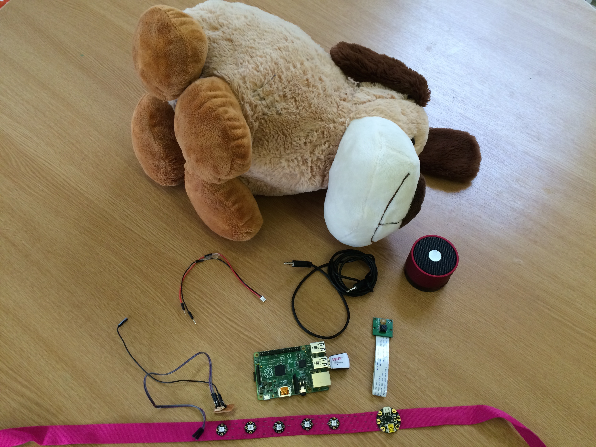   


##Building the collar
First have a read over [Adafruits conductive thread sewing guide.](https://learn.adafruit.com/conductive-thread/overview)

You will need to sew the Neopixels onto a ribbon using the conductive thread, see picture below for where to connect what.  
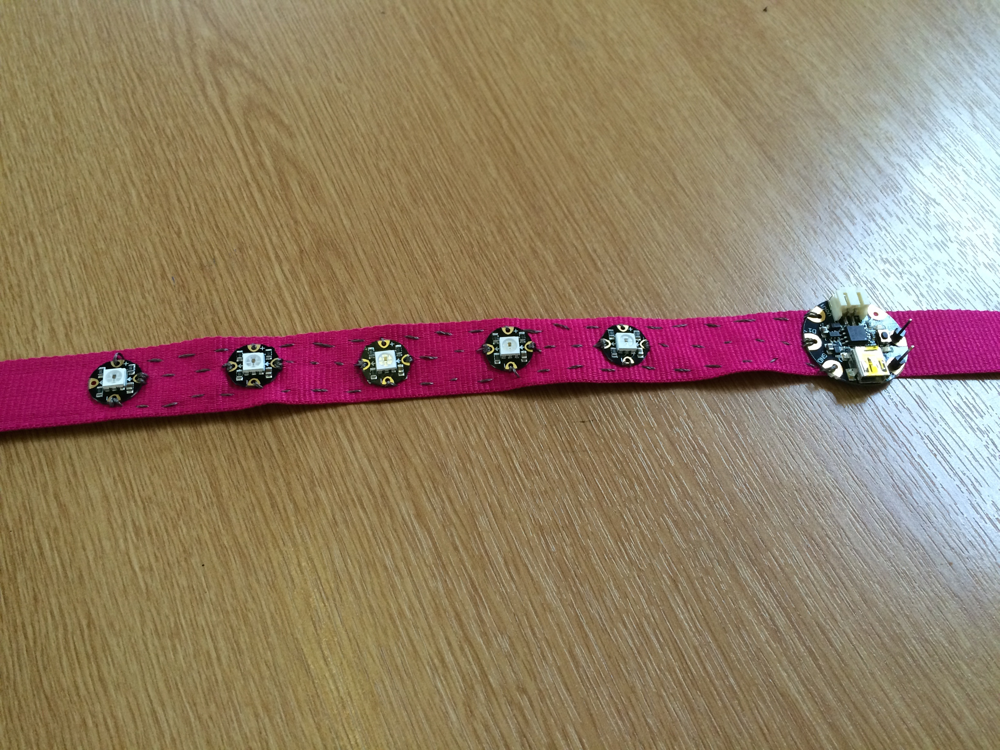   
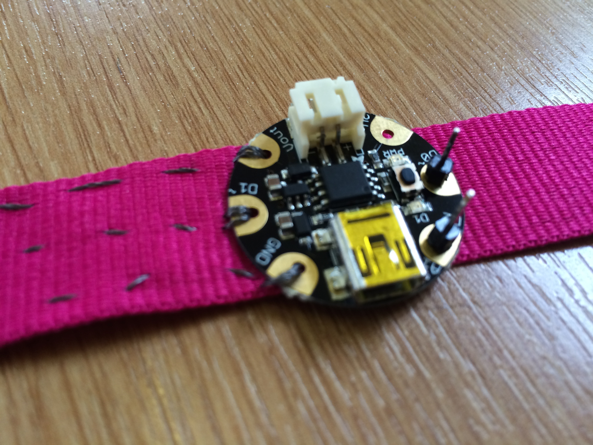   
    
##The dog   
Next we need to open up the dog and take out some stuffing so we can fit our electronics. Make an incision on the bottom of the dog and remove some stuffing.   
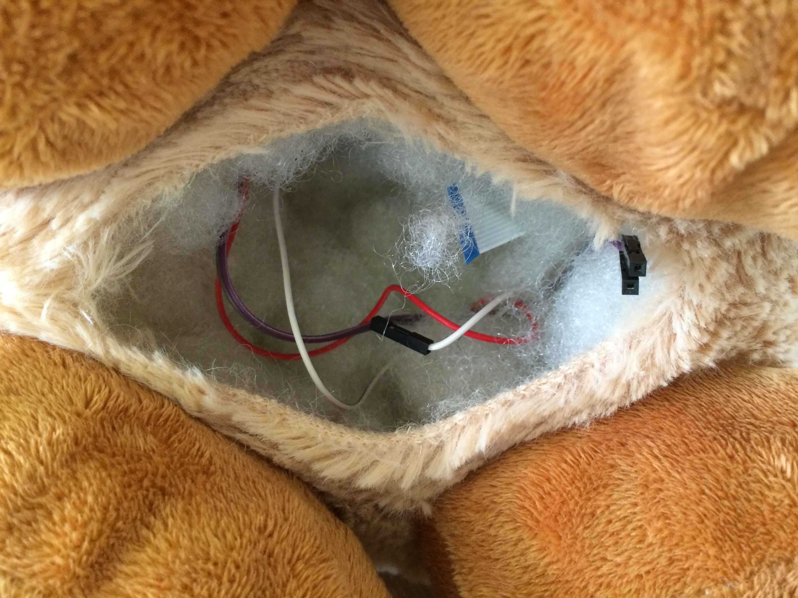   
    
Next feed some jumper wire through the dog from the hole in the bottom to up at the neck for the wires for the Gemma. You will need to make a small hole to pull the wires through.   
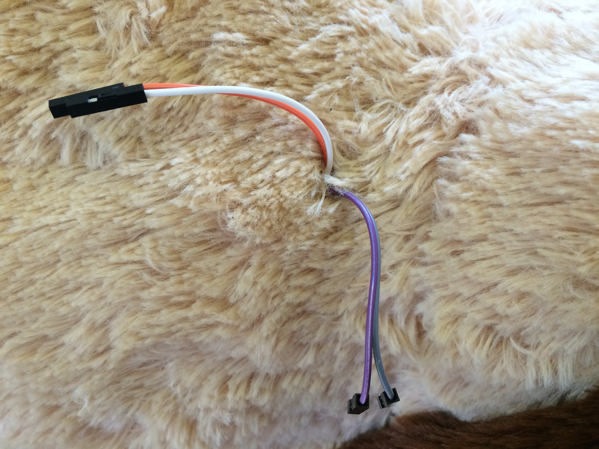  
    
Next, get a JST cable and solder on some jumper cables to it, you may want to get an adult to help with this part like we did.   
Make sure to cover the joins in something, we used tape.   
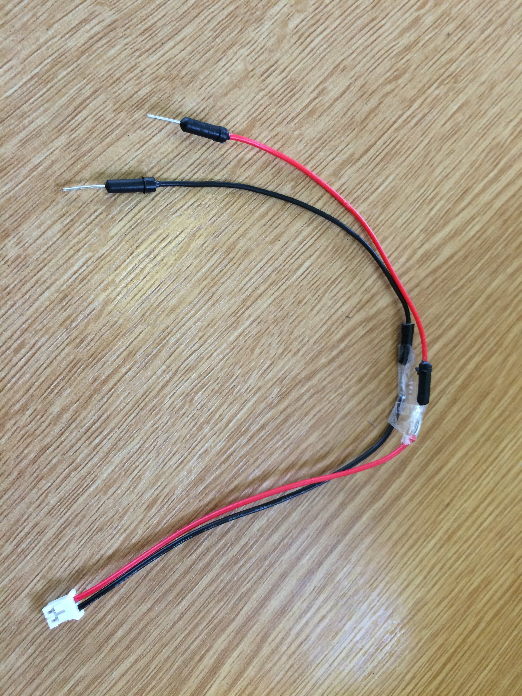   
   
Attach the collar to the dog and connect the JST cable to the Gemma and the other end to 2 of your 4 wires coming up through the dog.   
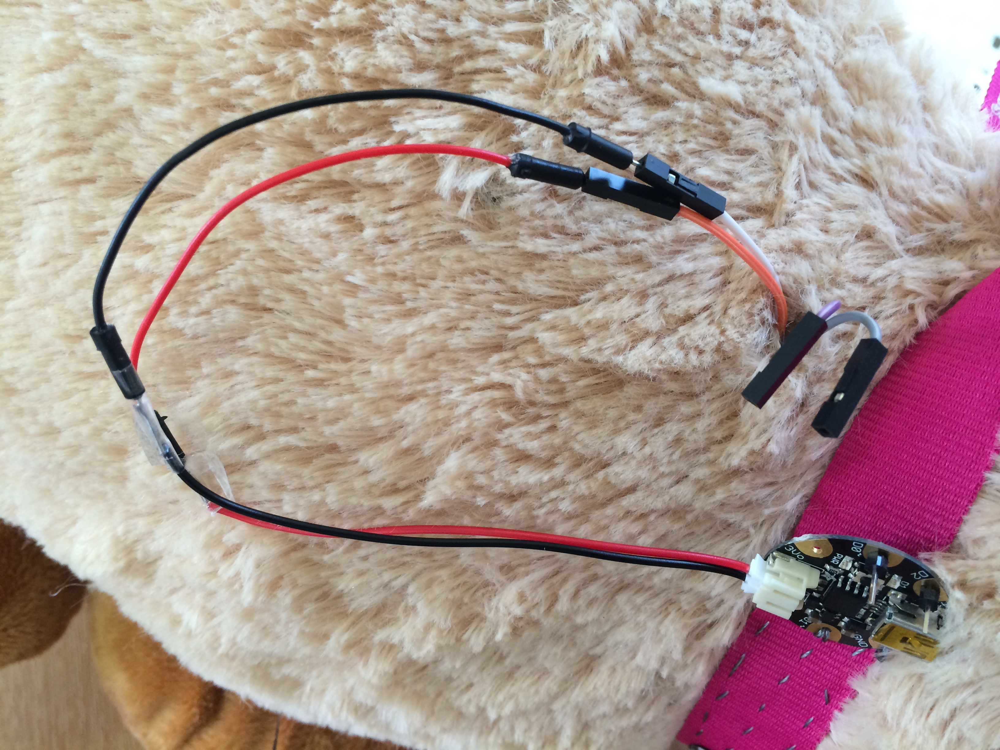   
    
Then attach the other 2 wires to your Gemma to D0 and D2.   
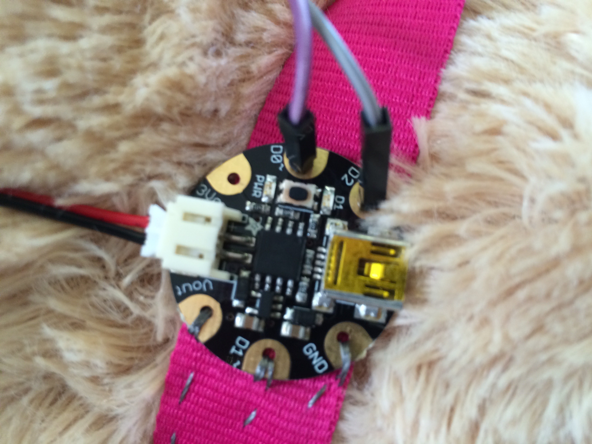  

##Programming the Gemma   
Download the [Arduino IDE](http://arduino.cc/en/main/software) and open our [gemma_dog.ino](https://raw.githubusercontent.com/VCB-Robotics/Rainbow-dog/master/code.gemma_dog.ino) program in it.   
Attach the Gemma via USB to the computer and hit the little button onboard to put it into programming mode so you can program it. Then hit upload on the computer.   

##Raspberry Pi   
Get your Raspberry Pi and load Raspbian on its SD card from the [Raspberry Pi Foundation download page.](http://www.raspberrypi.org/downloads/)    
Then grab our code by using the ```wget https://raw.githubusercontent.com/VCB-Robotics/Rainbow-dog/master/code/rainbow.py``` command.   
Attach your wifi dongle and using the wireless configuration tool on the desktop, connect to your wifi.   
Attach your camera module and speaker to the Raspberry Pi.   
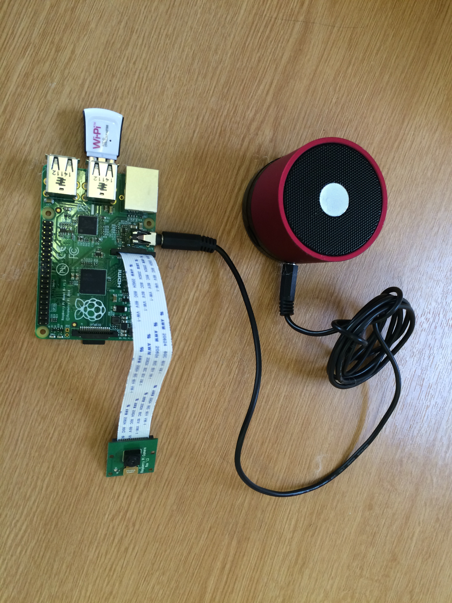
   
Then power down your Raspberry Pi and wire up your circuit like below   
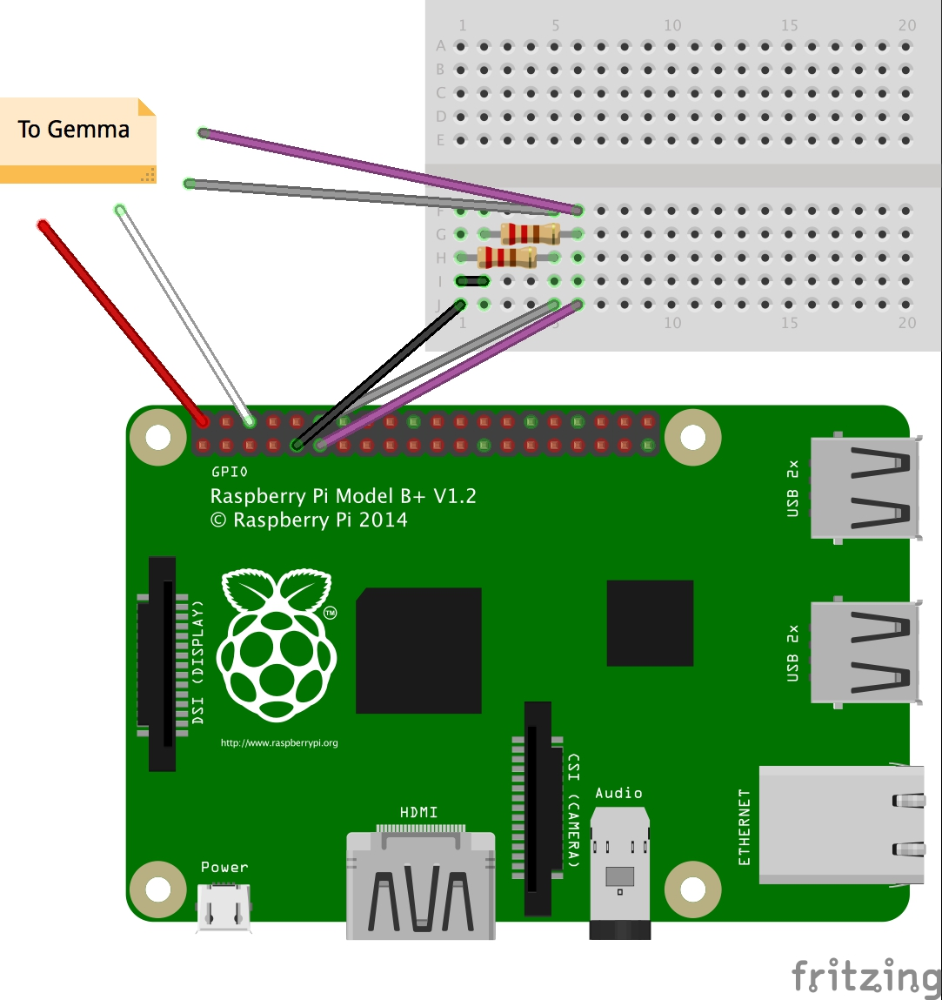   
   
You can use a breadboard or a stripboard if you want to make it a little more permanent like we did.   
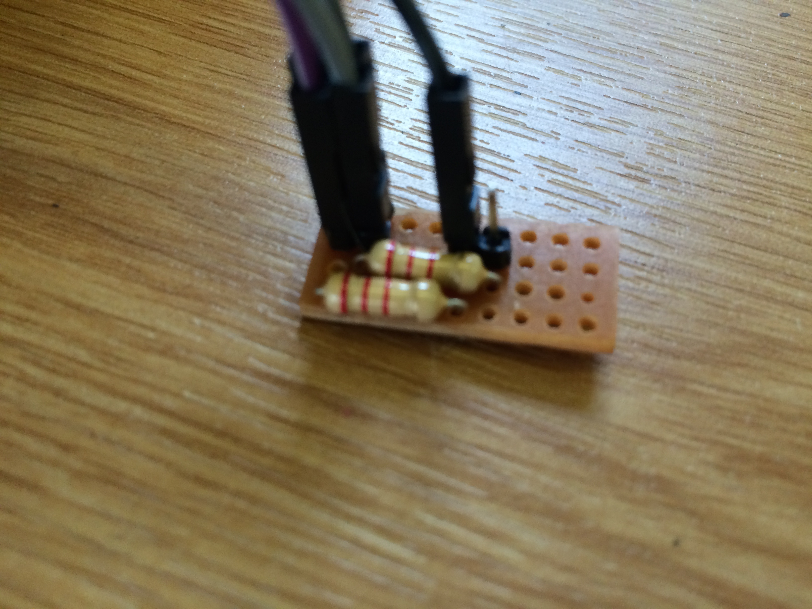   
Finally, put it all inside the dog, connect to the Raspberry Pi over SSH and run rainbow.py using ```sudo python rainbow.py```.   
    
